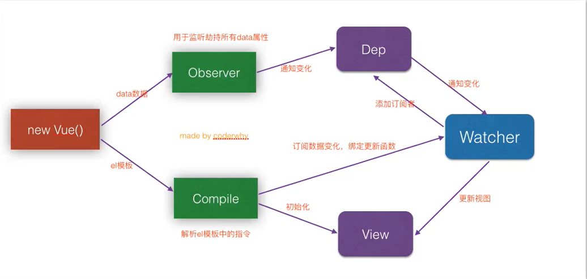

<!--
 * @Author: your name
 * @Date: 2020-06-24 15:29:16
 * @LastEditTime: 2020-07-22 17:28:38
 * @LastEditors: Please set LastEditors
 * @Description: In User Settings Edit
 * @FilePath: \myNotes\project\supermall\note.md
--> 
# 解决首页中可滚动区域的问题
* Better-Scroll在决定有多少滚动区域可以滚动时，是根据scrollHeight属性决定的
  - scrollHeight属性是根据放Better-Scroll的content中的子组件中的高度，但是我们的首页中，刚开始在计算scrollHeight属性时，是没有将图片计算在内的，所以计算结果是错误的，后来图片加载出来后有了新的高度，但是scrollHeight依然没有更新，所以出现了问题
* 如何解决这个问题
  - 监听每一张图片是否加载完成，只要有一张图片加载完成了，执行一次refresh()
  - 如何监听图片加载完成了？
    - 原生的js监听图片：img.onload=function(){}
    - Vue中的监听：@load='方法'
  - 调用scroll的refresh()
* 如何将GoodsListItem中的事件传入到Home.vue中
  - 因为涉及到非父子组件的事件传递，可以用事件总线

## 问题一:refresh找不到的问题
1. 在Scroll.vue中，调用this.scroll的方法之前，判断this.scroll是否有值
2. 在mounted生命周期函数中使用this.$refs.scroll而不是created中

## 问题二：refresh频繁，进行防抖操作
防抖debounce起作用的过程：
  如果我们直接执行refresh，那么refresh函数会被执行30次
  可将将refresh函数传入debounce函数中，生成一个新的函数
  之后在调用非常频繁的时候，就使用新生成的函数
  而新生成的函数，并不会非常频繁的调用，如果下一次执行来的非常快，那么上一次取消掉
```
debounce(func,delay){
  let timer = null
  return function(...args){
    // ...arg表示可以传入多个参数
    if(timer) clearTimeout(timer)
     timer = setTimeout(()=>{
      func.apply(this,args)
    },delay)
  }
```
# 事件总线（EventBus）
通过new Vue()创建一个空的vue实例来作为消息传输的对象，其实就是创建一个事件中心，相当于中转站，可以用它来传递事件和接收事件。但也就是太方便所以若使用不慎，就会造成难以维护的灾难，因此才需要更完善的Vuex作为状态管理中心，将通知的概念上升到共享状态层次。
## 如何使用
1. 初始化
```
// main.js  这种方式初始化的 EventBus 是一个 全局的事件总线
Vue.prototype.$EventBus = new Vue()
```
2. 发送事件
```
this.$bus.$emit('nameOfEvent',{ ... pass some event data ...});
```
3. 接收事件
```
this.$bus.$on('nameOfEvent',($event) => {
    // ...
})
```
4. 取消全局事件的监听
```
this.$bus.$off('nameOfEvent',具体取消哪个函数（即接收事件后的处理函数）)
如果后面不跟具体函数，那么会取消所有接收事件的监听

```
# tabControl的吸顶效果
在better-scroll中原先设置的position:sticky吸顶效果无效，且该样式不兼容老版本浏览器，故需另谋他法
## 1.获取到tabControl的offsetTop
```
必须知道滚动到多少时开始有吸顶效果，这个时候就需要获取tabControl的offsetTop
但是直接在mounted中获取，值不正确，因为获取时可能图片还没加载完（主要是轮播图加载较慢）
那么如何获取正确的值：
   1.监听HomeSwiper中img的加载完成
   2.加载完成后，发出事件，在Home.vue中获取正确的值
   this.$refs.tabControl.$el.offsetTop(this.$refs.tabControl获取到的是tab-control组件，没有offsetTop属性，但是$el可以获取到该组件对应的元素，有offsetTop属性)
   补充：
       为了不让HomeSwiper多次发出事件
       可以使用isLoad的变量进行状态的记录（只发送第一次，因为只需获取高度即可，后面的没必要）
    注意：这里不进行多次调用和debounce的区别
       防抖是为了防止在短时间内多次执行某函数，在设定的delay时间内如果下一次调用来到，则取消上一次，
       而此处是只进行第一次回调
    代码如下：
    swiperImageLoad(){
      // 只发送一次
      if(!this.isLoad){
        this.$emit('swiperImageLoad')
        this.isLoad = true
      }
    }
```
## 2.根据滚动值决定tabControl样式
```
错误方法：
当滚动距离大于offsetTop时，给tabControl设置position:fixed
会出现两个问题：
   1、商品区内容突然向上（因为tabControl脱离了文档流）
   2、tabContrl不见了（跟better-scroll滚动原理有关，其是通过设置transform:translate实现滚动，而该样式对fix定位的元素也有效，故即使设置了position:fix也会滚动）
正确方法：
  再设定一个tabControl（位置就在顶部）,当滚动距离大于offsetTop时显示，小于offsetTop时隐藏，并设置两个tabControl的样式,数据同步
```

# 让Home保持原来状态
1. 让Home不要随意被销毁：用keep-alive包住router-view
2. 让Home中的内容保持原有位置
   离开时保存一个位置信息scrollY(可通过scroll对象的y属性记录)
   进来时将位置设置为原来保存的位置scrollY(scrollTO函数)即可（回来后最好进行一次refresh）
```
activated(){
    // console.log('home活跃')
    this.$refs.scroll.scrollTo(0,this.scrollY,0)
    this.$refs.scroll.refresh()
  },
  deactivated(){
    // console.log('home不活跃')
    this.scrollY = this.$refs.scroll.scroll.y
  }
```
# 详情页相关
```
补充知识点：
1.ES6的类
class Person{
  constructor(a,b){
    this.a = a,
    this.b = b
  },
  this.c = c
}
类的继承
class People extends Person{
  
}

2.v-for也能遍历数字：从1开始
v-for="item in 10" 1~10

3.v-if="Object.keys(obj).length !== 0" 当obj内有值时才显示

4.将时间戳转换成常见的时间样式


5.混入(mixin)
混入 (mixin) 提供了一种非常灵活的方式，来分发 Vue 组件中的可复用功能。一个混入对象可以包含任意组件选项。当组件使用混入对象时，所有混入对象的选项将被“混合”进入该组件本身的选项。(components,data,methods,computed,created等钩子函数都可以作为混入的内容，但是需要注意的是，如methods中的函数中的语句是不能抽取的，这样只会覆盖，而不会合并，而如created,methods中的函数可以)

6.如何实现联动效果？点击nav-bar,页面滚动到相应的位置
- 1.在detail中监听标题的位置，获取index
- 2.滚动到对应的主题：
    获取所有的主题的offsetTop
    问题：如何获取到正确的offsetTop?
         1.created肯定不行：压根不能获取元素
         2.mounted也不行：数据还没获取到
         3.获取到数据的回调也不行:DOM还没渲染完(拿到了数据但是还没渲染完)
         4.$nextTick也不行：因为图片的高度没有被计算在内（根据最新的数据，DOM已经渲染完，但是图片还未加载完）
         5.图片加载完后，获取的高度才是正确的
* $nextTick(()=>{})
Vue.nextTick() 是在下次DOM更新循环结束之后执行延迟回调，在修改数据之后使用$nextTick，则可以在回调中获取更新后的DOM（dom的改变是发生在nextTick()之后），这个方法作用是当数据被修改后使用这个方法，会回调获取更新后的dom再render出来

在以下两个情况下需要用到Vue.nextTick()
1、Vue声明周期的created() 钩子函数进行的DOM操作一定要放在Vue.nextTick() 的回调函数中，因为created() 执行的时候DOM实际上并未进行任何渲染，此时进行DOM操作无异于徒劳，所以此处一定要将DOM操作的js代码放进Vue.nextTick()的回调函数中。

　　与之对应的就是mounted 钩子函数，因为该函数执行时所有的DOM挂载和渲染都已完成，此时再钩子函数中进行任何DOM操作都不会有问题。

2、在数据变化后要执行的某个操作，而这个操作需要使用随数据改变而改变的DOM结构的时候，这个操作应该放进Vue.nextTick() 的回调函数中

7.内容滚动，显示正确的标题

```

# 购物车
1. mapGetters辅助函数:将 store 中的 getter 映射到局部计算属性
```
import {mapGetters} from 'vuex'
export default {
  // ...
  computed: {
  // 使用对象展开运算符将 getter 混入 computed 对象中
    ...mapGetters([
      'doneTodosCount',
      'anotherGetter',
      // ...
    ])
  }
}

<!-- 如果你想将一个 getter 属性另取一个名字，使用对象形式 -->
...mapGetters({
  // 把 `this.doneCount` 映射为 `this.$store.getters.doneTodosCount`
  doneCount: 'doneTodosCount'
})
```
2. mapActions辅助函数 ：将store中的actions方法映射到局部methods中（用法同mapGetters)
3. 全选按钮
4. 购物车的弹窗
封装toast插件,弹窗用处较多，如若每次都引入组件，代码会很繁琐，故可封装成插件,在一开始即安装插件，用的时候再根据情况显示

# 面试题
1. 如何理解Vue生命周期
2. 如何进行非父子组件通信
3. Vue响应式原理
  - 数据发生改变，界面跟着更新，不是理所当然的
  
  (Object.defineProperty + 发布订阅者模式)
  
  大致流程：
  new Vue()——》用Object.defineProperty(get,set) 监听Vue中data属性——》给每个属性新建dep对象，内包含订阅该属性的订阅者订阅者由compile解析el模板中的指令——》watcher(订阅者)——》添加到发布者的subs中；
  当属性发生变化时：get-》发布者notify——》每个watcher进行update——》更新view